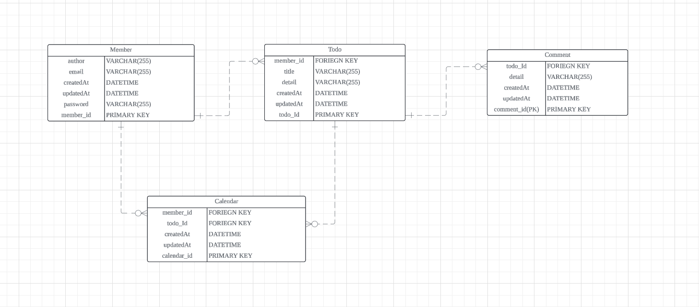

[ API 명세서 ]

| 기능 | Method | URL                         | Request          | Response |
| --- | --- |-----------------------------|------------------| --- |
| 유저 저장 | POST | /api/users                  | 요청 body          | 상태코드,상태boolean값,메세지 |
| 유저 단건 조회 | GET | /api/users/{id}             | 요청 path          | 단건 유저 |
| 유저 다건 조회 | GET | /api/users                  | 요청               | 다건 유저 |
| 유저 수정 | PUT | /api/users/{id}             | 요청 path, 요청 body | 상태코드,상태boolean값,메세지 |
| 유저 삭제 | DELETE | /api/users/{id}             | 요청 path          | 상태코드,상태boolean값,메세지 |
| 일정 저장  | POST | /api/todos                  | 요청 body          | 상태코드,상태boolean값,메세지 |
| 일정 단건 조회 | GET | /api/todos/{id}         | 요청 path          | 단건 일정 |
| 일정 수정 | PUT | /api/todos/{id}         | 요청 path, 요청 body | 상태코드,상태boolean값,메세지 |
| 일정 삭제 | DELETE | /api/todos/{id}         | 요청 path          | 상태코드,상태boolean값,메세지 |
| 댓글 저장 | POST | /api/comments/{todoId}      | 요청 path,body     | 상태코드,상태boolean값,메세지 |
| 댓글 단건 조회 | GET | /api/comments/{todoId}/{id} | 요청 path          | 단건 댓글 |
| 댓글 다건 조회 | GET | /api/comments/{todoId}      | 요청 path          | 다건 댓글 |
| 댓글 수정 | PUT | /api/comments/{todoId}/{id} | 요청 path, 요청 body | 상태코드,상태boolean값,메세지 |
| N페이지 조회 | GET | /api/query                  | 요청 param         | 일정제목, 일정내용, 댓글개수, 일정작성일, 일정수정일, 일정작성유저명 |

[ ERD ]

