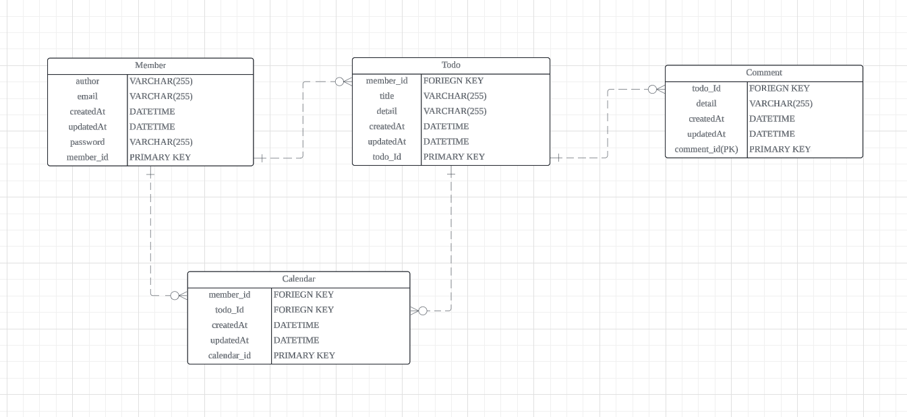

[ API 명세서 ]

| 기능 | Method | URL | Request | Response |
| --- | --- | --- | --- | --- |
| 유저 저장 (회원 가입) | POST | /api/members/signUp | 요청 body | Jwt 값 |
| 유저 접속 (로그인) | POST | /api/members/signIn | 요청 body | 상태코드,상태boolean값,메세지 |
| 유저 단건 조회 | GET | /api/members/{id} | 요청 path | 단건 유저 |
| 유저 다건 조회 | GET | /api/members | 요청 | 다건 유저 |
| 유저 수정 | PUT | /api/members/{id} | 요청 path, 요청 body | 상태코드,상태boolean값,메세지 |
| 유저 삭제 | DELETE | /api/members/{id} | 요청 path | 상태코드,상태boolean값,메세지 |
| 일정 담당 유저 배치 | PUT | /api/members/{memberId}/{todoId}/{workerId} | 요청 path | 상태코드,상태boolean값,메세지 |
| 일정 저장  | POST | /api/todos/{memberId} | 요청 path, 요청 body | 상태코드,상태boolean값,메세지 |
| 일정 단건 조회 | GET | /api/todos/{id} | 요청 path | 단건 일정 |
| 일정 다건 조회 | GET | /api/todos | 요청 | 다건 일정 |
| 일정 수정 | PUT | /api/todos/{id} | 요청 path, 요청 body | 상태코드,상태boolean값,메세지 |
| 일정 삭제 | DELETE | /api/todos/{id} | 요청 path | 상태코드,상태boolean값,메세지 |
| 댓글 저장 | POST | /api/comments/{todoId} | 요청 path,body | 상태코드,상태boolean값,메세지 |
| 댓글 단건 조회 | GET | /api/comments/{id} | 요청 path | 단건 댓글 |
| 댓글 다건 조회 | GET | /api/comments/query | 요청 param | 다건 댓글 |
| 댓글 수정 | PUT | /api/comments/{id} | 요청 path, 요청 body | 상태코드,상태boolean값,메세지 |
| 댓글 삭제 | DELETE | /api/comments/{id} | 요청 path | 상태코드,상태boolean값,메세지 |
| N페이지 조회 | GET | /api/query | 요청 param | 일정제목, 일정내용, 댓글개수, 일정작성일, 일정수정일, 일정작성유저명 |

[ ERD ]

